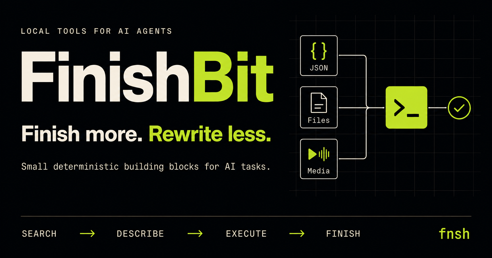

# FinishBit

[](https://github.com/fu9zhou/finish-bit/actions/workflows/ci.yml)
[](https://github.com/fu9zhou/finish-bit/releases)
[](https://pkg.go.dev/github.com/fu9zhou/finish-bit)
[](LICENSE)

English | [简体中文](docs/README.zh-CN.md) | [Documentation](docs/README.md)



> **Finish more. Rewrite less.**

**Small deterministic building blocks for AI tasks.**

FinishBit gives AI agents reusable capabilities for JSON and text transforms, file inspection and checksums, encoding and time utilities, and video or audio processing. Its local CLI, **`fnsh`**, lets an agent discover a capability, inspect its contract, and execute it with structured results.

**`fnsh` — Search. Reuse. Finish.**

```text
search → describe → execute → finish
```

## The idea

> **AI can write it. That doesn’t mean it should rewrite it.**

Common tasks should not require a freshly generated script every time. FinishBit starts with a simple principle: **finish the task with an existing deterministic capability.** The agent chooses the right capability and supplies the inputs; an existing implementation handles execution. When no capability fits, new tools can be added as reusable Operations.

**Reuse a bit. Finish the task.** A “bit” is a small, focused capability that completes one step of a task. In FinishBit’s contracts and documentation, that capability is called an **Operation**: it has a discoverable identifier, typed inputs and options, and structured results and errors.

For example, `video.trim` is the Operation the agent selects; `ffmpeg` is its provider. The Operation describes the task, while the provider supplies its implementation. A larger task can use several Operations.

Deterministic building blocks are the design goal: defined execution behavior replaces newly generated task logic. Each Operation’s contract defines its behavior; a UUID generator still produces fresh values, and file inspection reflects the current file.

## Core capabilities

| Area | Included capabilities |
| --- | --- |
| Discovery | Search by natural-language intent, inspect typed contracts, list the full catalog as JSON |
| JSON and text | Format, minify, validate, and query JSON; count, replace, sort, and deduplicate text |
| Files and utilities | Inspect file metadata, calculate checksums and hashes, encode Base64/URLs, convert time, generate UUIDs |
| Media | Trim and compress video or extract audio through a managed, checksum-verified FFmpeg runtime |
| Extensibility | Install language-neutral local extensions that publish new Operations through protocol v1 |

Core Operations run inside a single Go binary with no resident service. Large external runtimes are installed only when an Operation needs them, and `--json` provides stable machine-readable output for agents and automation.

## Project status

FinishBit is under active development before `v1.0.0`. The core runtime, `fnsh` CLI, managed FFmpeg provider, local extension protocol v1, and Agent Skill are implemented. See the [compatibility policy](docs/compatibility.md) before depending on pre-1.0 contracts in production.

## Why FinishBit

- **Task-oriented contracts:** invoke `video.trim` or `json.format`, not an implementation recipe.
- **Progressive discovery:** search returns a small, relevant capability set before detailed schemas enter agent context.
- **Deterministic core:** lightweight Operations use tested Go implementations with structured results and errors.
- **Managed tools:** large runtimes such as FFmpeg are installed on demand from pinned, checksum-verified artifacts.
- **Language-neutral extensions:** any executable can provide Operations through the versioned local JSON protocol.
- **One application core:** CLI today and a future Web/API adapter share `pkg/app`; transport code does not duplicate business logic.

## Quick start

FinishBit currently requires Go 1.25.13 or later when installing from source. Official archives are built with Go 1.26.8:

```bash
go install github.com/fu9zhou/finish-bit/cmd/fnsh@latest
```

Discover and run an Operation:

```bash
fnsh search "trim and compress video"
fnsh describe video.trim
fnsh json format data.json --indent 2
```

Install the managed FFmpeg runtime before using media Operations:

```bash
fnsh pkg add ffmpeg
fnsh video trim input.mp4 --start 10s --duration 20s -o clip.mp4
```

Use `fnsh run --request request.json --json` to submit a structured Operation request (see [example](examples/requests/replace.json)). Use `--json` for agents and automation. Successful JSON is written to stdout; structured errors are written to stderr.

For release archives, installer scripts, PATH setup, upgrades, and removal, see the [installation guide](docs/installation.md).

## Agent Skill

The repository ships `skills/finishbit`, which teaches compatible agents to discover an Operation before executing it and to prefer structured output. Copy or link that directory into the skill location supported by your agent host.

The Skill is an adapter, not a second runtime: every capability still executes through `fnsh` and the same application service.

## Extensions

An extension is a directory or ZIP containing a `finishbit-extension.json` manifest and one executable:

```bash
fnsh ext add ./my-extension
fnsh search "my capability"
```

Start with the [example extension](examples/extensions/echo/README.md), then consult the [extension protocol](docs/extension-protocol.md) and its [JSON Schema](schemas/extension-v1.schema.json).

Extensions execute as local third-party programs with the current user's permissions. Review their source and provenance before installation.

## Documentation

- [Documentation index](docs/README.md)
- [Installation and upgrades](docs/installation.md)
- [CLI reference](docs/cli-reference.md)
- [Operation catalog and contract](docs/operations.md)
- [Architecture](docs/architecture.md)
- [Extension protocol](docs/extension-protocol.md)
- [Development guide](docs/development.md)
- [Security policy](SECURITY.md)
- [Roadmap](docs/roadmap.md)

## Contributing and support

Read [CONTRIBUTING.md](CONTRIBUTING.md) before proposing a capability or opening a pull request. Use [GitHub Issues](https://github.com/fu9zhou/finish-bit/issues) for reproducible bugs and scoped proposals, and follow [SUPPORT.md](SUPPORT.md) for help and security boundaries.

Project decisions follow [GOVERNANCE.md](GOVERNANCE.md). Participation is governed by the [Code of Conduct](CODE_OF_CONDUCT.md).

## License

FinishBit is licensed under [GNU AGPL v3.0](LICENSE). Commercial use is permitted, but distribution of modified versions and covered network use must satisfy the license's corresponding-source requirements. This is a summary, not legal advice; the license text controls.

Managed third-party tools and installed extensions retain their own licenses.
