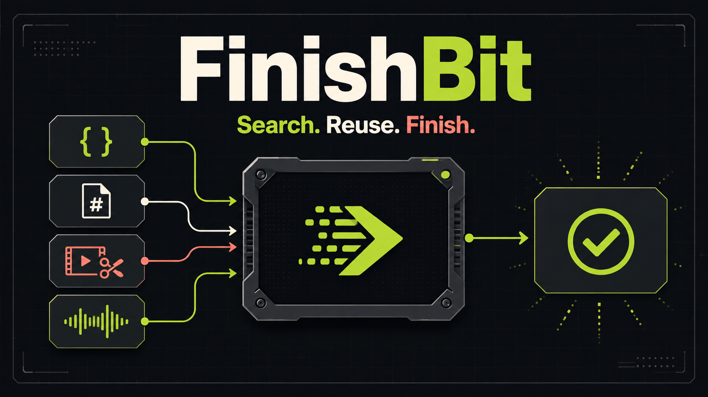

# FinishBit

[](https://github.com/fu9zhou/finish-bit/actions/workflows/ci.yml)
[](https://github.com/fu9zhou/finish-bit/releases)
[](https://pkg.go.dev/github.com/fu9zhou/finish-bit)
[](../LICENSE)

[English](../README.md) | 简体中文 | [完整文档](README.md)



> Search. Reuse. Finish. 搜索、复用、完成。

FinishBit 为 AI Agent 提供一个统一的本地 CLI，用来发现并可靠执行 JSON 与文本转换、文件检查与校验、编码与时间工具，以及视频和音频处理。

每项能力都是一个强类型 Operation。Agent 按意图搜索、读取契约、在本地执行并获得结构化结果，无须为每次任务临时生成脚本。

```text
搜索 → 描述 → 执行 → 完成
```

## 核心功能

| 领域 | 已提供的能力 |
| --- | --- |
| 能力发现 | 按自然语言意图搜索、查看强类型契约、以 JSON 列出完整能力目录 |
| JSON 与文本 | 格式化、压缩、校验和查询 JSON；统计、替换、排序和去重文本 |
| 文件与常用工具 | 查看文件信息、计算校验和与哈希、Base64/URL 编解码、时间转换、生成 UUID |
| 音视频处理 | 通过受托管且经过校验的 FFmpeg 裁剪或压缩视频、提取音频 |
| 扩展能力 | 安装语言无关的本地扩展，通过协议 v1 发布新的 Operation |

核心 Operation 运行在单个 Go 二进制中，无须常驻服务；大型外部运行时只在需要时安装。`--json` 为 Agent 和自动化提供稳定的机器可读结果。

## 项目状态

FinishBit 正处于 `v1.0.0` 前的积极开发阶段。核心运行时、`fnsh` CLI、托管 FFmpeg Provider、本地扩展协议 v1 和 Agent Skill 已经可用。生产环境依赖首个稳定版本前的接口前，请阅读[兼容性政策](compatibility.md)。

## 核心设计

- **任务导向：** 调用 `video.trim` 或 `json.format`，而不是要求 Agent 理解底层实现命令。
- **渐进式检索：** 默认只把最相关的少量能力放入上下文，确认后再读取完整契约。
- **确定性内核：** 轻量能力使用经过测试的 Go 实现，并提供结构化结果和错误。
- **依赖托管：** FFmpeg 等大型运行时按需下载到私有目录，来源、版本和 SHA-256 由 Runtime 固定。
- **语言无关扩展：** 任意可执行程序均可通过版本化本地 JSON 协议提供新 Operation。
- **统一应用层：** CLI 与未来 Web/API 共享 `pkg/app`，不会复制业务逻辑。

## 快速开始

从源码安装需要 Go 1.25.13 或更高版本；官方归档使用 Go 1.26.8 构建：

```bash
go install github.com/fu9zhou/finish-bit/cmd/fnsh@latest
```

搜索、确认并执行能力：

```bash
fnsh search "裁剪并压缩视频"
fnsh describe video.trim
fnsh json format data.json --indent 2
```

媒体 Operation 首次使用前需安装由 FinishBit 管理的 FFmpeg：

```bash
fnsh pkg add ffmpeg
fnsh video trim input.mp4 --start 10s --duration 20s -o clip.mp4
```

Agent 和自动化程序应使用 `--json`。成功 JSON 写入 stdout，结构化错误写入 stderr。版本包、安装脚本、升级和卸载方法参见[安装指南](installation.md)。

## Agent Skill 与扩展

仓库内的 `skills/finishbit` 指导兼容的 Agent 先搜索和描述 Operation，再通过 `fnsh` 执行。Skill 只是适配层，不包含第二套业务实现。

社区可以用任意语言实现本地扩展：

```bash
fnsh ext add ./my-extension
fnsh search "my capability"
```

请从[示例扩展](../examples/extensions/echo/README.md)开始，并阅读[扩展协议 v1](extension-protocol.md)。扩展会以当前用户权限执行；安装前必须自行审查来源和代码。

## 文档与社区

- [文档索引](README.md)
- [CLI 参考](cli-reference.md)
- [Operation 目录与契约](operations.md)
- [架构与 Web 扩展边界](architecture.md)
- [开发指南](development.md)
- [贡献指南](../CONTRIBUTING.md)
- [安全政策](../SECURITY.md)
- [支持边界](../SUPPORT.md)
- [路线图](roadmap.md)

项目决策遵循[治理规则](../GOVERNANCE.md)，社区参与遵循[行为准则](../CODE_OF_CONDUCT.md)。

## 许可证

FinishBit 采用 [GNU AGPL v3.0](../LICENSE)。许可证允许商业使用，但分发修改版本以及符合 AGPL 条件的网络使用必须履行对应源码义务。本段仅为摘要，不构成法律意见，具体以许可证原文为准。

托管的第三方工具和用户安装的扩展保留各自许可证。
