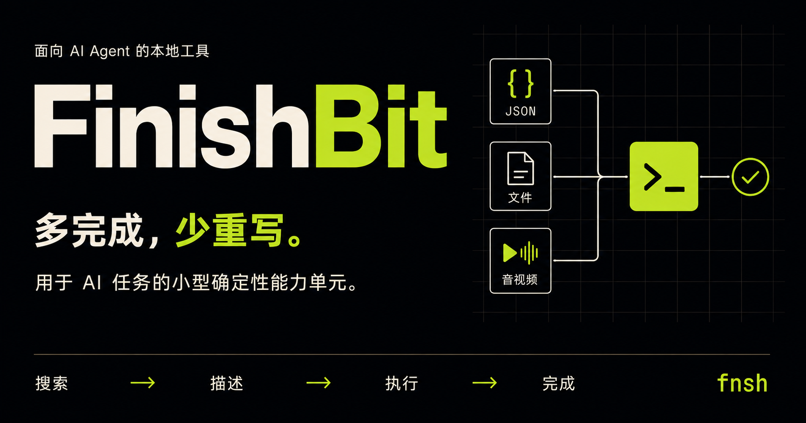

# FinishBit

[](https://github.com/fu9zhou/finish-bit/actions/workflows/ci.yml)
[](https://github.com/fu9zhou/finish-bit/releases)
[](https://pkg.go.dev/github.com/fu9zhou/finish-bit)
[](../LICENSE)

[English](../README.md) | 简体中文 | [完整文档](README.md)



> **多完成，少重写。**

**用于 AI 任务的小型确定性能力单元。**

FinishBit 为 AI Agent 提供可复用的能力，覆盖 JSON 与文本转换、文件检查与校验、编码与时间工具，以及视频和音频处理。通过本地 CLI **`fnsh`**，Agent 可以发现能力、查看契约、执行操作并获得结构化结果。

**`fnsh` —— 搜索、复用、完成。**

```text
搜索 → 描述 → 执行 → 完成
```

## 核心理念

> **AI 会写，不代表每次都应该重写。**

常见任务不应每次都需要临时生成脚本。FinishBit 从一个简单原则出发：**用已有的确定性能力完成任务。** Agent 选择合适的能力并提供输入，由已有实现负责执行。没有合适的能力时，可以把新工具添加为可复用的 Operation。

**复用一个 Bit，完成一个任务。** Bit 表示一个小而专注的能力单元，用来完成任务中的一个步骤。在 FinishBit 的契约和文档中，这种能力统一称为 **Operation**：它具有可检索的标识符、强类型输入与选项，以及结构化结果和错误。

例如，`video.trim` 是 Agent 选择的 Operation，`ffmpeg` 是它的 Provider（能力提供方）。Operation 描述要完成的任务，Provider 提供具体实现。更大的任务可以使用多个 Operation。

确定性能力单元是设计目标：以行为明确的执行过程取代临时生成的任务逻辑。每个 Operation 的具体行为由其契约定义；UUID 生成器仍会产生新值，文件检查反映的则是文件的当前状态。

## 核心功能

| 领域 | 已提供的能力 |
| --- | --- |
| 能力发现 | 按自然语言意图搜索、查看强类型契约、以 JSON 列出完整能力目录 |
| JSON 与文本 | 格式化、压缩、校验和查询 JSON；统计、替换、排序和去重文本 |
| 文件与常用工具 | 查看文件信息、计算校验和与哈希、Base64/URL 编解码、时间转换、生成 UUID |
| 音视频处理 | 通过受托管且经过校验的 FFmpeg 裁剪或压缩视频、提取音频 |
| 扩展能力 | 安装语言无关的本地扩展，通过协议 v1 发布新的 Operation |

核心 Operation 运行在单个 Go 二进制中，无须常驻服务；大型外部运行时只在需要时安装。`--json` 为 Agent 和自动化提供稳定的机器可读结果。

## 项目状态

FinishBit 正处于 `v1.0.0` 前的积极开发阶段。核心运行时、`fnsh` CLI、托管 FFmpeg Provider、本地扩展协议 v1 和 Agent Skill 已经可用。生产环境依赖首个稳定版本前的接口前，请阅读[兼容性政策](compatibility.md)。

## 为什么选择 FinishBit

- **任务导向：** 调用 `video.trim` 或 `json.format`，而不是要求 Agent 理解底层实现命令。
- **渐进式检索：** 默认只把最相关的少量能力放入上下文，确认后再读取完整契约。
- **确定性内核：** 轻量能力使用经过测试的 Go 实现，并提供结构化结果和错误。
- **依赖托管：** FFmpeg 等大型运行时按需下载到私有目录，来源、版本和 SHA-256 由 Runtime 固定。
- **语言无关扩展：** 任意可执行程序均可通过版本化本地 JSON 协议提供新 Operation。
- **统一应用层：** CLI 与未来 Web/API 共享 `pkg/app`，不会复制业务逻辑。

## 快速开始

从源码安装需要 Go 1.25.13 或更高版本；官方归档使用 Go 1.26.8 构建：

```bash
go install github.com/fu9zhou/finish-bit/cmd/fnsh@latest
```

搜索、确认并执行能力：

```bash
fnsh search "裁剪并压缩视频"
fnsh describe video.trim
fnsh json format data.json --indent 2
```

媒体 Operation 首次使用前需安装由 FinishBit 管理的 FFmpeg：

```bash
fnsh pkg add ffmpeg
fnsh video trim input.mp4 --start 10s --duration 20s -o clip.mp4
```

Agent 和自动化程序应使用 `--json`。成功 JSON 写入 stdout，结构化错误写入 stderr。

版本归档、安装脚本、PATH 配置、升级和卸载方法参见[安装指南](installation.md)。

## Agent Skill

仓库内的 `skills/finishbit` 指导兼容的 Agent 先发现 Operation，再执行操作，并优先使用结构化输出。将该目录复制或链接到 Agent 宿主支持的 Skill 目录即可使用。

Skill 是适配层，不是第二套运行时：所有能力仍通过 `fnsh` 和同一个应用服务执行。

## 扩展

一个扩展是包含 `finishbit-extension.json` 清单和一个可执行程序的目录或 ZIP 文件：

```bash
fnsh ext add ./my-extension
fnsh search "my capability"
```

请从[示例扩展](../examples/extensions/echo/README.md)开始，并阅读[扩展协议](extension-protocol.md)及其 [JSON Schema](../schemas/extension-v1.schema.json)。

扩展作为本地第三方程序，以当前用户权限执行。安装前请审查其源代码和来源。

## 文档

- [文档索引](README.md)
- [安装与升级](installation.md)
- [CLI 参考](cli-reference.md)
- [Operation 目录与契约](operations.md)
- [架构](architecture.md)
- [扩展协议](extension-protocol.md)
- [开发指南](development.md)
- [安全政策](../SECURITY.md)
- [路线图](roadmap.md)

## 贡献与支持

提议新能力或提交 Pull Request 前，请阅读[贡献指南](../CONTRIBUTING.md)。可复现的问题和范围明确的提案请提交到 [GitHub Issues](https://github.com/fu9zhou/finish-bit/issues)；支持方式及安全边界参见[支持指南](../SUPPORT.md)。

项目决策遵循[治理规则](../GOVERNANCE.md)，社区参与遵循[行为准则](../CODE_OF_CONDUCT.md)。

## 许可证

FinishBit 采用 [GNU AGPL v3.0](../LICENSE)。许可证允许商业使用，但分发修改版本以及符合 AGPL 条件的网络使用必须履行对应源码义务。本段仅为摘要，不构成法律意见，具体以许可证原文为准。

托管的第三方工具和用户安装的扩展保留各自许可证。
